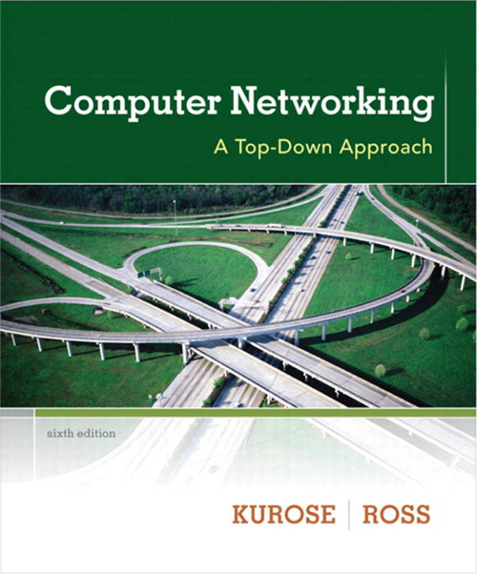

# Computer Networking: A Top-Down Approach Solutions

## Introduction

Welcome to the solutions for exercises from the book *Computer Networking: A Top-Down Approach* (6th edition). This project began during my enrollment in **Computer Networking I - COMM.NET.200** at Tampere University in Summer 2024.

Given the concise lecture slides and limited assistance available during the summer course, I hope these solutions will help you in your studies or your independent learning journey through the book.

## About This Folder

This folder is part of a larger repository containing all the materials I've worked on during my time at the university. This specific section includes solutions for the book, which is the main resource for the course alongside recorded videos and lecture slides (as of 2024). Although newer editions of the book (such as the 7th or 8th) are available, these solutions correspond to the 6th edition, which my university provided the electronically license at that time. Most exercises remain largely unchanged in newer editions, with only minor reordering, so these solutions should still be useful.

## How to Use This Folder

- Each subfolder is named after a chapter in the book.
- Inside each subfolder, you'll find markdown files containing solutions to the chapter's questions and problems.

## Feedback and Contributions

Mistakes are unavoidable, and I welcome any feedback or suggestions for improvement. You can contribute in the following ways:

- **Discussions**: Use the Discussions tab related to this folder for general feedback and discussions.
- **Pull Requests**: Feel free to suggest changes or improvements through pull requests.

## Future Plans

I plan to complete solutions for all remaining problems in the book. Stay tuned for updates!

---

Happy learning!

---